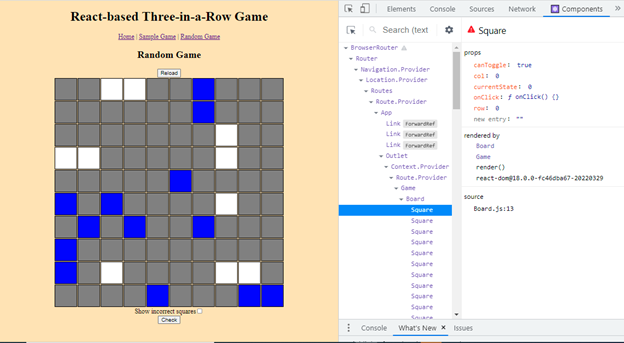

[![LinkedIn][linkedin-shield]][linkedin-url]
[![Youtube][youtube-shield]][youtube-url]
[![Joyce Ding][portfolio-shield]][portfolio-url]

    <h1 align="center">React-based Three-in-a-Row Game</h1>

    <a href="https://react.dev/learn/tutorial-tic-tac-toe#setup-for-the-tutorial">
    Sample Tic-Tac-Toe</img>
</a>
    

## About The Project 
1. Refactor the Three-in-a row game that we built for Assignment 4B into a React application.
2. The React application will use the API data from both the original sample and random links.
3. The React application will make use of React Routing to allow both the sample game grid and a random one to be chosen via links.

    <!-- Sample Tic-Tac-Toe</img>
    Sample Tic-Tac-Toe</img>
    Sample Tic-Tac-Toe</img> -->

### Requirement
1. The display grid should be an HTML table. The table must be generated only using JavaScript and without using the document.write() function to output the table tags.
2. Add unobtrusive JavaScript events to certain squares in the puzzle so that repeatedly left clicking on the square will cycle through and change its state to one of three distinct possibilities:
    i.	Empty (State 0)
    ii.	State 1
    iii.	State 2
3. At any time during the playing of the puzzle the end user should be able to click a “Check Puzzle” button that displays one of the following status outputs
    i.	“So far so good” (all colored squares are correct, but the puzzle is incomplete)
    ii.	“Something is wrong” (one or more of the colored squares is incorrectly assigned)
    iii.	“You did it!!” (all squares are correct, and the puzzle has been completely filled in)
4.	A checkbox can be checked at any time which will cause the puzzle to display any incorrect squares. Unchecking the box will remove the indication of any incorrect squares.
5.	All JavaScript code will be unobtrusive.
7.	Add one Innovative Feature to your version of the puzzle which will add meaningful value to the playing of the game is optional.
8. Squares that are set to a color (or image if you wish) at the beginning of the puzzle should not be changeable as stated in the JSON data.

### API for Json
[Api Data Sample 6*6 ](https://prog2700.onrender.com/threeinarow/sample)
[Api Data Random](https://prog2700.onrender.com/threeinarow/random)

### Built With
1. React JS Javascript. 
2. HTML.
3. CSS.

### Dependency
1. Node >= 14 on your local development machine
2. `npm i react-router-dom --save styled-components`
3. `npm install react-icons --save`

### Editor
* VS Code

## Acknowledgement 
1. Most of the requirement and content are from Delano Marques's course *Client side Technology*

## Learning React source
[React dev](https://react.dev/)
[Codecademy React Cheatsheets](https://www.codecademy.com/learn/react-101/modules/learn-react-components/cheatsheet)

## About how to write a readme
[Reference article :what-is-readme-md-file](https://www.geeksforgeeks.org/what-is-readme-md-file/)
[Static Badge](https://shields.io/badges)
[Markdownguide](https://www.markdownguide.org/basic-syntax/#reference-style-links )

## Links
[linkedin-shield]: https://img.shields.io/badge/-LinkedIn-black.svg?style=for-the-badge&logo=linkedin&colorB=555
[linkedin-url]: https://linkedin.com/in/joycedingcanada
[youtube-shield]: https://img.shields.io/badge/-Youtube-black.svg?style=for-the-badge&logo=youtube&colorB=555
[youtube-url]: https://www.youtube.com/@WhyHowJoyce
[portfolio-shield]: https://img.shields.io/badge/-JoyceDing-black.svg?style=for-the-badge&colorB=555
[portfolio-url]: https://main--joyceding.netlify.app/